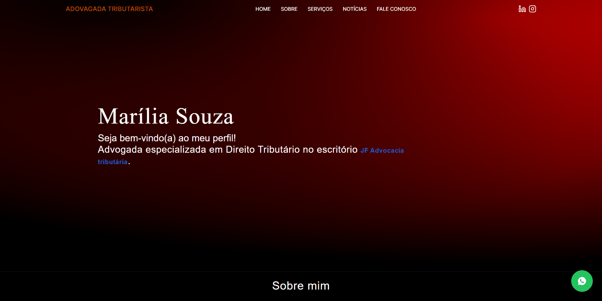

# Projeto Pessoal | Marília Advogada Tributarista

## Tabela do Conteudos

   <!-- * [Sobre](#sobre) -->
   * [Objetivo](#objetivo)
   * [Exposição do projeto](#exposição-do-projeto)
      * [Cabeçalho](#cabeçalho)
      <!-- * [Perfil](#perfil) -->
      <!-- * [Sobre Mim](#sobre-mim) -->
      * [Apresentação](#apresentação)
      <!-- * [Habilidades](#habilidades) -->
      <!-- * [Projetos](#projetos) -->
      * [Rodapé](#rodapé)
   * [Tecnologias](#tecnologias)
   <!-- * [Acessando o site](#acessando-o-site) -->

<!-- ## Sobre -->

## Objetivo

Desenvolver um site na qual será publicado na web, para uma Advogada Tributarista.

Irei utilizar o NextJS para um melhor desempenho da minha aplicação, sigo estudando este framework a partir do momento em que decidi criar este web-site e utilizando essa incrível ferramente. Escolhi esse framework devido ao seu sistema de roteamento e por permitir gerar partes do meu site antes em um servidor, ao invés de está sendo sempre atualizado e gerado no navegador do usuário, e também para criar um blog.

## Exposição do projeto

- ### Cabeçalho

> Neste cabeçalho foi aplicado um efeito de Menu Transparente, que ao realizar a rolagem na página,  um novo background é alterado, tranzendo suavidade e estética.

- ### Apresentação

> Aqui está o conteudo inicial de apresentação, com uma âncora que ao clicar direciona ao site oficial da JF Advocacia tributária.

- ### Rodapé

> No rodapé, deixei alguns links para as redes sociais, e descrição do Copyright ©.

## Tecnologias

<ul>
<li>HTML</li>
<li>CSS</li>
<li>JavaScript</li>
<li>TypeScript</li>
<li>React</li>
<li>TailwindCSS</li>
<li>NextJS</li>
<li>GIT BASH</li>
</ul>